# Implementation of Papers on Adversarial Examples
Implementation of papers with real-time visualizations and parameter control.

## Dependencies  
* Python3  
* PyTorch (built from source)
* OpenCV  
* NumPy 
* SciPy
* TensorBoard

## Contents
* [Adversarial perturbations are not random noise. DNNs are robust to such random perturbations.](random_perturbations/)
* [Fast Gradient Sign Method (FGSM)](fgsm/)
* [Basic Iterative Method](iterative/)
* [One Pixel Attack](one_pixel_attack)
* [AdvGAN - Generating Adversarial Examples with Adversarial Networks](adv_gan/)
* [Spatially Transformed Adversarial Examples](spatially_transformed/)
* [Generative Adversarial Trainer](gat/)


------------------------------------------------
# Random Perturbations  

From one of the first papers on Adversarial examples - [Explaining and Harnessing Adversarial Examples](https://arxiv.org/abs/1412.6572),
> The direction of perturbation, rather than the specific point in space, matters most. Space is
not full of pockets of adversarial examples that finely tile the reals like the rational numbers.  

This project examines this idea by testing the robustness of a DNN to randomly generated perturbations.

## Usage
```bash
$ python3 explore_space.py --img images/horse.png
```


## Demo
   

This code adds to the input image (`img`) a randomly generated perturbation (`vec1`) which is subjected to a max norm constraint `eps`. This adversarial image lies on a hypercube centerd around the original image. To explore a region (a hypersphere) around the adversarial image (`img + vec1`), we add to it another perturbation (`vec2`) which is constrained by L<sub>2</sub> norm `rad`.  
Pressing keys `e` and `r` generates new `vec1` and `vec2` respectively.  


## Random Perturbations   
 
 The classifier is robust to these random perturbations even though they have severely degraded the image. Perturbations are clearly noticeable and have significantly higher max norm.  
 
 | 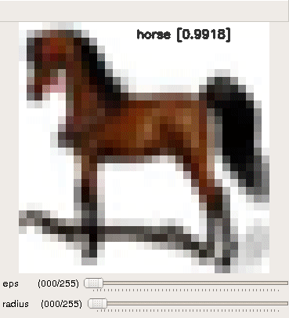 |  |  |  
 |:------------------------------------------:|:-----------------------:|:-----------:|  
 |             **horse**                      |      **automobile**     |: **truck** :|  
 
 In above images, there is no change in class labels and very small drops in probability.

## FGSM Perturbations  
A properly directed perturbation with max norm as low as 3, which is almost imperceptible, can fool the classifier.    

 | 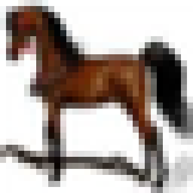 | 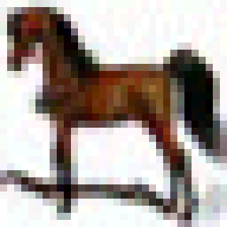 |  |
 |:---------:|:--------------------:|:--------------------------:|
 | **horse** |  predicted - **dog** | perturbation **(eps = 6)** |  
 


</br>  
</br>

# Fast Gradient Sign Method (FGSM)

[Paper](https://arxiv.org/abs/1412.6572)  

## Usage

* **Run the script**
```bash
$ python3 fgsm_mnist.py --img one.jpg --gpu
```  

```bash
$ python3 fgsm_imagenet.py --img goldfish.jpg --model resnet18 --gpu
```  

```fgsm_mnsit.py``` - for attack on custom model trained on MNIST whose weights are ```9920.pth.tar```.  
```fgsm_imagenet``` - for pretrained imagenet models - resnet18, resnet50 etc.


* **Control keys**  
  - use trackbar to change `epsilon` (max norm)  
  - `esc` - close  
  - `s` - save perturbation and adversarial image  


## Demo    
 


## Results  
#### MNIST
| Adversarial Image | Perturbation | 
|:----:|:----:|   
|  |  |  
| Pred: 4 | eps: 38 |  
|  |  |  
| Pred: 7 | eps: 60 |   
|  |  |  
| Pred: 8 | eps: 42 |  
|  |  |  
| Pred: 8 | eps: 12 |    
|  |  |  
| Pred: 9 | eps: 17 |    


</br>  
</br>
  
# Basic Iterative Method (Targeted and Untargeted)
Paper: [Adversarial examples in the physical world](https://arxiv.org/abs/1607.02533)  


## Usage  
* **Run the script**
```bash
$ python3 iterative.py --img images/goldfish.jpg --model resnet18 --target 4
# If argument 'target' is not specified, it is untargeted attack
```
* **Control keys**  
  - use trackbar to change `epsilon` (max norm of perturbation) and `iter` (number of iterations)  
  - `esc` close  and `space` to pause
  - `s` save perturbation and adversarial image  


## Demo 


</br>  
</br>

# One Pixel Attack for Fooling Deep Neural Networks

[Paper](https://arxiv.org/abs/1710.08864)  

> Existence of single pixel adversarial perturbations suggest that the assumption made in [Explaining and Harnessing Adversarial Examples](https://arxiv.org/pdf/1412.6572.pdf) that small additive perturbation on the values of many dimensions will accumulate and cause huge change to the output, might not be necessary for explaining why natural images are sensitive to small perturbations. 


## Usage

```bash
$ python3 one_pixel.py --img airplane.jpg --d 3 --iters 600 --popsize 10
```  
`d` is number of pixels to change (**L<sub>0</sub>** norm)  
`iters` and `popsize` are paprameters for [Differential Evolution](https://pablormier.github.io/2017/09/05/a-tutorial-on-differential-evolution-with-python/)  

## Results  

Attacks are typically successful for images with low confidence. For successful attacks on high confidence images increase `d`, i.e., number of pixels to perturb.

|  | 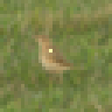 | 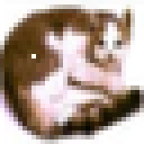  |         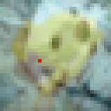 |  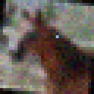  |
|:------------------------------------------:|:----------------------------------:|:---------------------------------:|:-----------------------------------------:|:--------------------------------------:|  
| **bird [0.8075]**                   |               **deer [0.8933]**           |  **frog [0.8000]**                |                        **bird [0.6866]**   |       **deer [0.9406]**                |


</br>  
</br>

# AdvGAN - Generating Adversarial Examples with Adversarial Networks

[Paper](https://arxiv.org/pdf/1801.02610.pdf) | IJCAI 2018  


## Usage

#### Inference
```bash
$ python3 advgan.py --img images/0.jpg --target 4 --model Model_C --bound 0.3
```  
Each of these settings has a separate Generator trained. This code loads appropriate trained model from ```saved/``` directory based on given arguments. As of now there are 22 Generators for different targets, different bounds (0.2 and 0.3) and target models (only ```Model_C``` for now).


#### Training AdvGAN (Untargeted)
```bash
$ python3 train_advgan.py --model Model_C --gpu
```  
#### Training AdvGAN (Targeted)
```bash
$ python3 train_advgan.py --model Model_C --target 4 --thres 0.3 --gpu
# thres: Perturbation bound 
```  
Use ```--help``` for other arguments available (```epochs```, ```batch_size```, ```lr``` etc.)


#### Training Target Models (Models A, B and C)
```bash
$ python3 train_target_models.py --model Model_C
```  

For TensorBoard visualization,
```bash
$ python3 generators.py
$ python3 discriminators.py
```  

This code supports only MNIST dataset for now. Same notations as in paper are followed (mostly).


## Results 
There are few changes that have been made for model to work.
* Generator in paper has ```ReLU``` on the last layer. If input data is normalized to [-1 1] there wouldn't be any perturbation in the negative region. As expected accuracies were poor (~10% Untargeted). So ```ReLU``` was removed. Also, data normalization had significat effect on performance. With [-1 1] accuracies were around 70%. But with [0 1] normalization accuracies were ~99%.
* Perturbations (```pert```) and adversarial images (```x + pert```) were clipped. It's not converging otherwise.

These results are for the following settings.
* Dataset - MNIST
* Data normalization - [0 1]
* thres (perturbation bound) - 0.3 and 0.2
* No ```ReLU``` at the end in Generator
* Epochs - 15
* Batch Size - 128
* LR Scheduler - ```step_size``` 5, ```gamma``` 0.1 and initial ```lr``` - 0.001


| Target     |Acc [thres: 0.3]  | Acc [thres: 0.2] |
|:----------:|:---------:|:---------:|
| Untargeted | 0.9921    | 0.8966    |    
| 0          | 0.9643    | 0.4330    |
| 1          | 0.9822    | 0.4749    |  
| 2          | 0.9961    | 0.8499    |
| 3          | 0.9939    | 0.8696    |  
| 4          | 0.9833    | 0.6293    |
| 5          | 0.9918    | 0.7968    |  
| 6          | 0.9584    | 0.4652    |
| 7          | 0.9899    | 0.6866    |  
| 8          | 0.9943    | 0.8430    |
| 9          | 0.9922    | 0.7610    |  


#### Untargeted
| 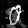 | 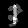 |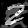 |  |  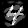 | 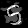 | 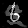 | 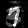 | 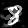 | 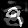 | 
|:----:|:----:|:----:|:----:|:----:|:----:|:----:|:----:|:----:|:----:|
|Pred: 9|Pred: 3|Pred: 8|Pred: 8|Pred: 4|Pred: 3|Pred: 8|Pred: 3|Pred: 3|Pred: 8|


#### Targeted
| Target: 0 | Target: 1 | Target: 2 | Target: 3 | Target: 4 | Target: 5 | Target: 6 | Target: 7 | Target: 8 | Target: 9 |  
|:----:|:----:|:----:|:----:|:----:|:----:|:----:|:----:|:----:|:----:|
| 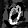 | 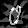 |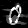 | 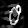 |  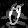 | 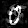 | 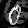 | 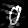 | 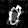 | 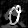 |
|Pred: 0|Pred: 1|Pred: 2|Pred: 3|Pred: 4|Pred: 5|Pred: 6|Pred: 7|Pred: 8|Pred: 9|
| 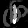 | 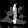 |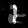 | 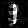 |  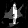 | 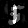 | 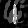 | 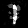 | 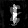 | 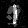 |
|Pred: 0|Pred: 1|Pred: 2|Pred: 3|Pred: 4|Pred: 5|Pred: 6|Pred: 7|Pred: 8|Pred: 9|
|  | 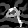 |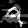 | 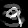 |  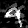 | 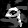 | 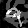 | 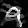 | 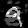 | 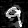 |
|Pred: 0|Pred: 1|Pred: 2|Pred: 3|Pred: 4|Pred: 5|Pred: 6|Pred: 7|Pred: 8|Pred: 9|

    


</br>  
</br>

# Spatially Transformed Adversarial Examples
[Paper](https://arxiv.org/abs/1801.02612) | ICLR 2018  
Refer [View Synthesis by Appearance Flow](https://people.eecs.berkeley.edu/~tinghuiz/papers/eccv16_appflow.pdf) for clarity.


## Usage
```bash
$ python3 stadv.py --img images/1.jpg --target 7
```  
Requires OpenCV for real-time visualization.  


## Demo
         

## Results  
#### MNIST
Column index is target label and ground truth images are along diagonal. 
  
  


</br>  
</br>


