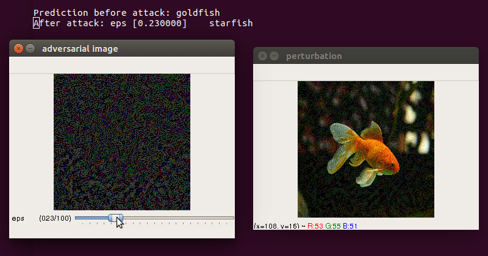
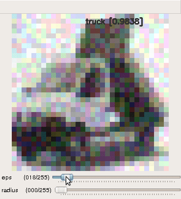
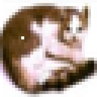
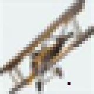

# Implementation of papers on Adversarial attacks and defences

## Dependencies  
* Python3  
* PyTorch  
* OpenCV  
* NumPy 
* SciPy


## Fast Gradient Sign Method
Paper: [Adversarial examples in the physical world](https://arxiv.org/abs/1607.02533)  
### Usage  
* **Run the script**
```bash
$ python3 fgsm.py --img images/goldfish.jpg --model inception_v3
```
* **Control keys**  
  - use trackbar to change `epsilon` (max norm)  
  - `esc` close  
  - `s` save perturbation and adversarial image  


* **Demo**   
  
  


---  

## Basic Iterative Method (Targeted and Non-targeted)  
Paper: [Adversarial examples in the physical world](https://arxiv.org/abs/1607.02533)  
### Usage  
* **Run the script**
```bash
$ python3 iterative.py --img images/goldfish.jpg --model resnet18 --y_target 4
```
* **Control keys**  
  - use trackbar to change `epsilon` (max norm of perturbation) and `iter` (number of iterations)  
  - `esc` close  and `space` to pause
  - `s` save perturbation and adversarial image  


* **Demo**  


---  

From one of the first papers on Adversarial examples - [Explaining and Harnessing Adversarial Examples](https://arxiv.org/abs/1412.6572) by Ian Goodfellow,
> The direction of perturbation, rather than the specific point in space, matters most. Space is
not full of pockets of adversarial examples that finely tile the reals like the rational numbers.  

To test this, I've written `explore_space.py`. 

   

This code adds to the input image (`img`), a randomly generated perturbation (`vec1`) which is subjected to a max norm constraint `eps`. To explore a region (a hypersphere) around this adversarial image (`img + vec1`) , we add to it another perturbation (`vec2`) which is constrained by L<sub>2</sub> norm `rad`.  By pressing keys `e` and `r`, new `vec1` and `vec2` are generated respectively.  

 * Random perturbations   
 The classifier is robust to these random perturbations even though they have significantly higher max norm.  
 
 |  |  |  |  
 |:------------------------------------------:|:-----------------------:|:-----------:|  
 |             **horse**                      |      **automobile**     |: **truck** :|  
  

* Generated perturbation by FGSM  
A properly directed perturbation with max norm as low as 3, which is almost imperceptible, can fool the classifier.    

 |  |  |  |
 |:---------:|:--------------------:|:--------------------------:|
 | **horse** |  predicted - **dog** | perturbation **(eps = 6)** |  
 
 

 
 ---  
  
 ## One Pixel Attack  
 Paper: [One pixel attack for fooling deep neural networks](https://arxiv.org/abs/1710.08864)  
 * **Run the script**
```bash
$ python3 one_pixel.py --img images/airplane.jpg --d 3 --iters 600 --popsize 10
```  
Here, `d` is number of pixels to change (L<sub>0</sub> norm). Finding successful attacks was difficult. I noticed that only images with low confidence are giving successful attacks. 

|  |  |  
|:----------------------------:|:---------------------------------:|  
| **frog [0.8000]**            |        **bird [0.8073]**          |  


---  
 
 
## Generative Adversarial Trainer  
Paper: [Generative Adversarial Trainer: Defense to Adversarial Perturbations with GAN](https://arxiv.org/pdf/1705.03387)  

### Architecture  
  


* To train ` python3 gat.py`  
* Trainig has not been done. The generator doesn't converge. Also, I'm a bit skeptical about this, they did not show any adverarial images in paper.  


---  

## Adversarial Spheres  
Paper: [Adversarial Spheres](https://arxiv.org/abs/1801.02774)  

---  

## AdvGAN  
Paper: [Generating Adversarial Examples with Adversarial Networks](https://arxiv.org/abs/1801.02610)  
##### [WIP]  

---  

## Fast Feature Fool  
Paper: [Fast Feature Fool: A data independent approach to universal adversarial perturbations](https://arxiv.org/abs/1707.05572)  
##### [WIP]  

---  

## ToDo:  

- [ ] [Synthesizing Robust Adversarial Examples](https://arxiv.org/abs/1707.07397) &mdash; adversarial examples that
are robust across any chosen distribution of transformations  
- [ ] [The Space of Transferable Adversarial Examples](https://arxiv.org/pdf/1704.03453.pdf) &mdash; novel methods for estimating dimensionality of the space of adversarial inputs  
- [ ] [On Detecting Adversarial Perturbations](https://arxiv.org/pdf/1702.04267.pdf) &mdash; augment Neural Networks with a small detector subnetwork which performs binary classification on distinguishing genuine data from data containing adversarial perturbations  
- [ ] [Towards Robust Deep Neural Networks with BANG](https://arxiv.org/pdf/1612.00138.pdf) &mdash; Batch Adjusted Network Gradients  
- [ ] Deepfool, JSMA, [CW](https://arxiv.org/pdf/1608.04644.pdf) &mdash; math intensive

