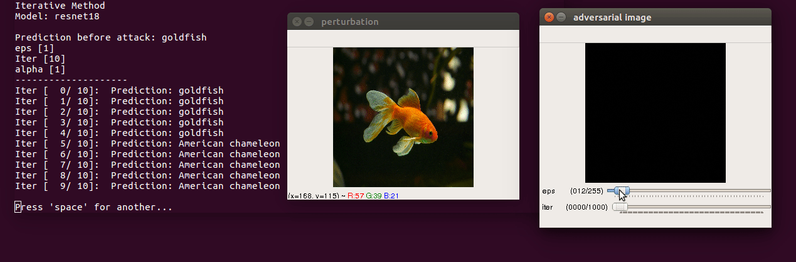

# Basic Iterative Method (Targeted and Untargeted) 

Paper: [Adversarial examples in the physical world](https://arxiv.org/abs/1607.02533)  


## Usage  
* **Run the script**
```bash
$ python3 iterative.py --img images/goldfish.jpg --model resnet18 --target 4
# If argument 'target' is not specified, it is untargeted attack
```
* **Control keys**  
  - use trackbar to change `epsilon` (max norm of perturbation) and `iter` (number of iterations)  
  - `esc` close  and `space` to pause
  - `s` save perturbation and adversarial image  


## Demo 

