# Semantic Adversarial Examples

>Images that are arbitrarily perturbed to fool the model, but in such a way that the modified image semantically represents the same object as the original image.
>
>  &mdash; <cite>Semantic Adversarial Examples, Hosseini et al., CVPRW 2018.</cite>

These attacks are discussed in the following papers:
1. [Semantic Adversarial Examples](https://arxiv.org/pdf/1804.00499.pdf) (CVPR Workshops 2018)
2. [Towards Compositional Adversarial Robustness: Generalizing Adversarial Training to Composite Semantic Perturbations](https://arxiv.org/pdf/2202.04235.pdf) (CVPR 2023) 

This repository implements **only single semantic attacks** discussed in [2]. The attacks are
constructed using Projected Gradient Descent (PGD) on the following components:
* Hue
* Saturation
* Rotation
* Brightness
* Contrast

See section 3.2. of [2] for the math behind these attacks.


## Dependencies  
* Python3  
* PyTorch
* [Kornia](https://github.com/kornia/kornia) (A differentiable computer vision library for PyTorch)
* OpenCV
* NumPy
* tqdm

## Contents

`attacks.py`: contains both gradient-based search and random search of the five semantic perturbation parameters.  
`main.py`: computes the robust accuracy of a model against single attacks. Need to manually change the model and the attack.  
`save_examples.py`: saves some adversarial images to disk, along with their original images.  
`examples`: contains some adversarial examples.  
`models`: VGG16 and ResNet models.  
`weights`: VGG16 and ResNet50 weights, trained on CIFAR-10.  
`visualizations`: codes to visualize the attacks.  


## Experiments 

Robust accuracy of single semantic attacks on ResNet50 trained on CIFAR-10.

|       | Clean |     Hue     | Saturation  |  Rotation   | Brightness  |  Contrast   |
|:------|------:|:-----------:|:-----------:|:-----------:|:-----------:|:-----------:|        
| Mine  | 92.72 |    81.65    |    92.37    |    88.49    |    90.04    |    91.40    |  
| Paper |  95.2 | 81.8 ± 0.0  | 94.0 ± 0.0  | 88.1 ± 0.1  | 92.1 ± 0.1  | 93.7 ± 0.1  |


## Examples
Untargeted examples (read ibm repo different nomenclature)

### Hue

|          Clean           |           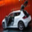            |                        |            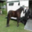            |           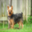            |           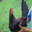            |
|:------------------------:|:--------------------------------------------------------------------------------------:|:----------------------------------------------------------------------------------------:|:----------------------------------------------------------------------------------------:|:---------------------------------------------------------------------------------------:|:---------------------------------------------------------------------------------------:|
|      **Perturbed**       | 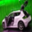 |  | 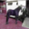 | 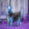 | 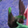 |
|     **Pred before**      |                                       automobile                                       |                                           ship                                           |                                          horse                                           |                                           dog                                           |                                          bird                                           |
| **Pred after**<br/>(hue) |                                    dog<br/>(1.836)                                     |                                    frog<br/>(-0.193)                                     |                                    truck<br/>(-1.913)                                    |                                    deer<br/>(3.142)                                     |                                     dog<br/>(2.274)                                     |


### Saturation

|              Clean              |           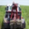            |                       |           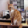            |                       |                       |
|:-------------------------------:|:-----------------------------------------------------------------------------------------------:|:-----------------------------------------------------------------------------------------------:|:-----------------------------------------------------------------------------------------------:|:-----------------------------------------------------------------------------------------------:|:-----------------------------------------------------------------------------------------------:|
|          **Perturbed**          | 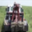 | 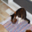 | 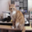 | 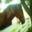 | 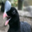 |
|         **Pred before**         |                                              truck                                              |                                               cat                                               |                                               cat                                               |                                              horse                                              |                                              bird                                               |
| **Pred after**<br/>(saturation) |                                        ship<br/>(0.700)                                         |                                         dog<br/>(1.156)                                         |                                     automobile<br/>(0.700)                                      |                                        bird<br/>(1.159)                                         |                                         dog<br/>(0.874)                                         |


### Rotation

|             Clean             |            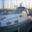            |           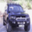            |                       |                        |                        |
|:-----------------------------:|:--------------------------------------------------------------------------------------------:|:-------------------------------------------------------------------------------------------:|:--------------------------------------------------------------------------------------------:|:---------------------------------------------------------------------------------------------:|:---------------------------------------------------------------------------------------------:|
|         **Perturbed**         | 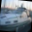 | 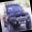 |  | 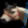 | 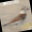 |
|        **Pred before**        |                                             ship                                             |                                         automobile                                          |                                             ship                                             |                                             horse                                             |                                             bird                                              |
| **Pred after**<br/>(rotation) |                                   automobile<br/>(-6.318)                                    |                                       cat<br/>(9.400)                                       |                                       frog<br/>(0.383)                                       |                                       cat<br/>(-9.586)                                        |                                       cat<br/>(10.000)                                        |


### Brightness

|              Clean              |                        |                        |                       |            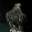            |            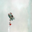            |
|:-------------------------------:|:----------------------------------------------------------------------------------------------:|:-----------------------------------------------------------------------------------------------:|:-----------------------------------------------------------------------------------------------:|:------------------------------------------------------------------------------------------------:|:------------------------------------------------------------------------------------------------:|
|          **Perturbed**          | 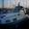 | 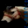 | 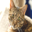 | 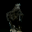 |  |
|         **Pred before**         |                                              ship                                              |                                              horse                                              |                                               cat                                               |                                               bird                                               |                                             airplane                                             |
| **Pred after**<br/>(brightness) |                                    automobile<br/>(-0.200)                                     |                                        dog<br/>(-0.150)                                         |                                        frog<br/>(0.125)                                         |                                        frog<br/>(-0.134)                                         |                                        bird<br/>(-0.023)                                         |


### Contrast

|             Clean             |                       |           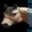            |                       |           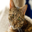            |                       |
|:-----------------------------:|:-------------------------------------------------------------------------------------------:|:--------------------------------------------------------------------------------------------:|:--------------------------------------------------------------------------------------------:|:---------------------------------------------------------------------------------------------:|:---------------------------------------------------------------------------------------------:|
|         **Perturbed**         | 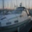 | 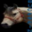 | 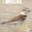 |  | 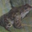 |
|        **Pred before**        |                                            ship                                             |                                            horse                                             |                                             bird                                             |                                              cat                                              |                                             frog                                              |
| **Pred after**<br/>(contrast) |                                   automobile<br/>(0.773)                                    |                                       cat<br/>(0.836)                                        |                                       cat<br/>(1.109)                                        |                                       frog<br/>(0.700)                                        |                                        cat<br/>(0.711)                                        |


## Citations

```bibtex
@inproceedings{hosseini2018semantic,
  title={Semantic adversarial examples},
  author={Hosseini, Hossein and Poovendran, Radha},
  booktitle={Proceedings of the IEEE Conference on Computer Vision and Pattern Recognition Workshops},
  pages={1614--1619},
  year={2018}
}
```

```bibtex
@article{tsai2022towards,
  title={Towards compositional adversarial robustness: Generalizing adversarial training to composite semantic perturbations},
  author={Tsai, Yun-Yun and Hsiung, Lei and Chen, Pin-Yu and Ho, Tsung-Yi},
  journal={arXiv preprint arXiv:2202.04235},
  year={2022}
}
```
