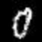
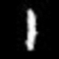
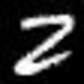
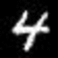
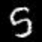
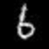
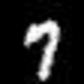
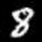
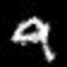

# Spatially Transformed Adversarial Examples
[Paper](https://arxiv.org/abs/1801.02612) | ICLR 2018  
For clarity refer [View Synthesis by Appearance Flow](https://people.eecs.berkeley.edu/~tinghuiz/papers/eccv16_appflow.pdf).


## Usage
```bash
$ python3 stadv.py --img images/1.jpg --target 7
```  
Requires OpenCV for real-time visualization.  


## Demo
         

## Results  
#### MNIST
Column index is target label and ground truth images are along diagonal. 
  
  


